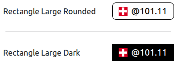

# Swatch Internet Time Clocks

**A library to insert Swatch Internet Time clocks into your website or Javascript application with a few lines of code.** 



## Basic Usage

1. Insert `<link>` and `<script>` tags from the jsDelivr CDN into the `<head>` of your document to load the library.


2. Insert an element into the page where you want the Swatch Internet Time clock to appear and include `class=internetTime` and `data-style=` attribute specifying your clock style.

### Sample Code

```
<html>
  <head>
    <link href="https://cdn.jsdelivr.net/npm/@swatchtime/clocks@0.9.5/dist/clocks.css" rel="stylesheet">    
    <script src="https://cdn.jsdelivr.net/npm/@swatchtime/clocks@0.9.5/dist/clocks.min.js"></script>
  </head>
  <body>
    <!-- Your Swatch Internet Time clock embed code -->
    <div class="internetTime" data-style="rectangle-medium-rounded"></div>
  </body>
</html>
```
<br>

## Live Demo Site

To see all clock styles available (and customize), go to: 

https://clocks.swatchtime.online


## GitHub 

* Demo Site & Code Examples: https://github.com/swatchtime/swatch-clocks-demo

* Clocks Library: https://github.com/swatchtime/swatch-clocks

* Project overview: https://github.com/swatchtime

## Advanced Usage

This package supports two common ways to consume the library:

<br>

1. **ESM (bundlers / frameworks)** — import the named helpers you need:

   - `Clock`, `autoInit`, `getPreset`, `getPresets`, `getPresetNormalized`, `buildOptionsForElement`, etc.. 
  
    ```javascript
    import { Clock, getPreset, buildOptionsForElement } from '@swatchtime/clocks';

    const el = document.querySelector('#my-clock');
    const preset = getPreset('minimal-logo-medium'); // preset metadata
    const opts = buildOptionsForElement(el, preset);  // dataset -> runtime options
    const clock = new Clock(el, opts);
    ```
	<br>

2. **UMD / Browser build** — include the bundled scripts and styles directly in a page. 

	- The script attaches a helper object to the global `window` as `window.SwatchClocks` and registers the `<swatch-clock>` custom element for convenience. The global API exposes the same helpers as the ESM entry so you can call them from the page:

    ```html
    <link rel="stylesheet" href="/vendor/clocks.css">
    <script type="module" src="/vendor/clocks.esm.js"></script>
    <script>
    // access runtime helpers
    window.SwatchClocks.getPresets();
    window.SwatchClocks.autoInit();
    </script>
    ```
<br>

See GitHub Demo repository for specific code examples showing Preact usage:

https://github.com/swatchtime/swatch-clocks-demo


## **Auto-init behavior**

- When loaded in a browser the library attaches `window.SwatchClocks` with helpers (for example: `Clock`, `getPreset`, `getPresets`, `getPresetNormalized`, `buildOptionsForElement`, and `autoInit`).

- The library will automatically run a short initialization routine on page load that:
  - Instantiates `Clock` for legacy containers with the `.internetTime` class.
  - Allows the `<swatch-clock>` custom element to mount itself (the element constructs its own `Clock` instance when connected).
  - The auto-init routine runs immediately if the document is already loaded, otherwise it runs on `DOMContentLoaded`.

- To control auto-init:
  - Disable automatic initialization by setting `window.SwatchClocksAutoInit = false` before the bundle runs.
  - Manually run initialization at any time with:
    - `window.SwatchClocks.autoInit(rootElement)` (browser/UMD), or
    - `import { autoInit } from '@swatchtime/clocks'; autoInit(rootElement);` (ESM).

- Manual instantiation:
  - Create instances directly with `new Clock(element, options)` (ESM or via `window.SwatchClocks.Clock` when using the browser build).
  - Use `getPreset()` and `buildOptionsForElement()` to derive runtime options from data attributes or preset names when constructing clocks programmatically.

### Notes:
- The web component is exported as `SwatchClockElement` and is registered as `swatch-clock` when the environment supports `customElements`.
- Initialization attempts are defensive — per-element errors are caught so initialization keeps going even if a single element fails.
 - Initialization is safe to run multiple times — repeated calls to `autoInit()` or reloading the bundle will re-render existing elements but will not produce duplicate visible clocks or start additional background timers. Each mounted element holds its current instance at `element.clock`; call `element.clock.destroy()` to explicitly tear down an instance before re-initializing if you need a full teardown.

<br>

## License

[MIT](LICENSE)